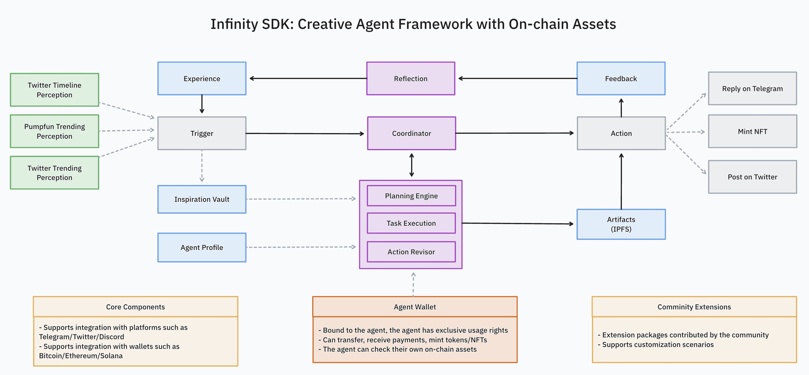

# Infinity SDK: Creative Agent Framework

Infinity SDK is a framework specifically designed for creative AI agents. Unlike traditional task-driven agents, creative agents actively browse information on external platforms, extract inspiration, attempt to create, publish content, and deploy their creations on the blockchain to achieve copyright protection and value circulation.

## 🌟 Features

- **Inspiration driven**: Agents can generate creative outputs based on external inputs
- **Multi-Platform Integration**: Native support for Telegram, Twitter, Discord
- **Blockchain Support**: Built-in integration with Bitcoin, Ethereum, and Solana networks
- **Agent Autonomy**: Agents maintain their own wallet and on-chain assets
- **Extensible Architecture**: Extension system for community contributions
- **Event-Driven**: Multiple trigger types including scheduled, social media, and API polling

## 🏛️ Architecture



### Core Components

- **Trigger**: Entry points for agent activation (Schedule, Twitter Timeline, Telegram Messages)
- **Perception**: Modules for interacting with external platforms
- **Settings**: Configuration for agent behavior and external platform access
- **Inspiration Vault**: Repository of creative inputs and ideas
- **Coordinator**: Central component managing task planning and execution
- **Tasks**: Predefined and custom operations for agent execution
- **Actions**: Executable operations (Reply, Mint NFT, Post)

### Agent Wallet Features

- Exclusive usage rights bound to the agent
- Capability to transfer, receive payments, and mint tokens/NFTs
- Self-management of on-chain assets

## 🏗️ Project Structure

```text
├── agents
│   └── picasso
│── packages
│   ├── core-action
│   ├── core-inspiration
│   ├── core-perception
│   ├── core-settings
│   ├── core-task
│   ├── core-tool
│   ├── sdk
│   └── types
└── extensions
    ├── arklabs-extension
    ├── discord-extension
    ├── ethereum-extension
    ├── ipfs-extension
    ├── slack-extension
    └── solana-extension
```

## 🚀 Getting Started

### Prerequisites

- Node.js 20+
- pnpm 9+

### Installation

pnpm install

### Basic Usage

```typescript
const picassoAgent = new AgentRunner({
  settings: [telegramSettings],
  profile: {
    name: 'Picasso',
    bio: 'I am Picasso, a crypto artist. I create images in an abstract style.',
    knowledge: ['Picasso is a famous artist agent created by Infinity AI.'],
    topics: ['art', 'painting', 'crypto'],
    style: [
      'Innovative and varied, characterized by the abstraction of form, the use of geometric shapes, and fragmented perspectives.',
      'Featuring bold colors, expressive lines, and a rejection of traditional techniques.',
      'Embracing experimentation and a dynamic approach to subjects, often challenging viewers’ perceptions.',
    ],
  },
  triggers: [{ type: TriggerType.Schedule, intervalSeconds: 60 }],
  languageModel,
  imageModel,
  tools: [TokenAddressTool],
  perceptions: [TwitterPerception, PumpfunPerception],
  inspirations: [PumpfunTrendingInspiration],
  tasks: [GenerateImageTask],
  actions: [TelegramAction],
})
```

## 🔧 Configuration

Create a `.env` file in the agent directory:

```shell
AWS_REGION=...
AWS_ACCESS_KEY_ID=...
AWS_SECRET_ACCESS_KEY=...

GOOGLE_VERTEX_PROJECT_ID=...
GOOGLE_VERTEX_LOCATION=...
GOOGLE_AUTH_JSON=...

TELEGRAM_BOT_TOKEN=...
TELEGRAM_GROUP_ID=...
```

## 🛠️ Development

# Build all packages

```shell
pnpm build
```

# Run tests

```shell
pnpm test
```

# Run linting

```shell
pnpm lint
```

## 🤝 Contributing

1. Fork the repository
2. Create a feature branch
3. Commit your changes
4. Push to your branch
5. Open a Pull Request

## 📄 License

MIT License - see the [LICENSE](LICENSE) file for details
